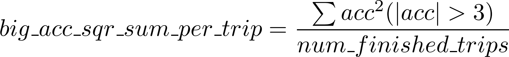
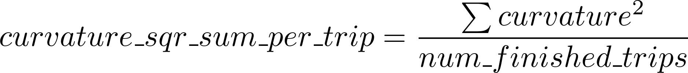

# PnC Final Project 

## Project Background
After finishing homework5 and homework6, you have known how to drive your autonomous vehicle to finish a trip from a start point to an end point with low speed in the simulation environment. 

In the final project, you are going to make your vehicle agent able to finish multiple routes in a complicated virtual environment, which includes vehicle agents written by other students, mocked pedestrians, and traffic lights.  

## Task

### Overall Description

Generally speaking, you will implement your own self-driving agent, which can
* Efficiently finish 10 trips one by one 
* Avoid collision with other vehicles
* Yield to pedestrians
* Avoid running red traffic light 

### Simulation World


Following two elements are added into simulation world:

#### Traffic Lights

All traffic lights are divided into two groups, traffic lights in south-north direction and east-west direction. Lights in the same group will always have the same color. Lights in different group will have opposite color. 

Color of the traffic lights changes periodically. Here are duration of each phase:
* Yellow - 3 seconds
* Red - 20 seconds
* Yellow - 3 seconds
* Green - 20 seconds

Source code of traffic light controlling could be found at `pnc/simulation/traffic_light_agent.cc`. 


#### Mocked Pedestrians
Mocked pedestrians always run in uniform linear motion between 3km/h to 6km/h. They will occasionally change their heading. And they won't actively hit vehicles. 

Source code of mocked pedestrians could be found at `pnc/simulation/mocked_obstacle_agent.cc`. 

### Detailed Task

Same as homework6, you are going to implement a class derived from base class `VehicleAgent`, which contains two main functions:
* `void Initialize(const AgentStatus& agent_status);` The function will be called once with an initial status of the vehicle agent after your vehicle agent is constructed.
* `ControlCommand RunOneIteration(const AgentStatus& agent_status)` The function will be called every 0.01 seconds in simulation time. Your vehicle need to generate a control command based on your vehicle's current status passed in the function parameter.

### Agent Status

In final project, definition of `AgentStatus` is extended compare to homework6. In detail, it contains following parts:
* Vehicle Status. Same as homework6
* Route Status. Beside existing `destination` in homework6, a new field `is_new_router_request` is added. It will indicate if a router request is refreshed in one iteration. The router request will be refreshed if we considering your vehicle has reached previous destination in static state (velocity becomes zero). 
* Perception Status. It contains two parts. One is all of the traffic light status. Another one is all obstacles (pedestrians and vehicles) in 100m. 
* Simulation Status. Meta info of simulation, such as simulation time and the vehicle's alive status. 

The definition could be found at `common/proto/agent_status.proto`

### Others

* Control command definition is the same as homework6
* Vehicle's registration method is the same as homework6

## Map
In the final project, your vehicle agents will run in the map called “grid3”. It’s still a virtual map, but has bigger size and more elements than “grid2” you used in previous homeworks. 

Basically, it’s a 3*3 grid map with a bigger size. Beside its size, traffic lights are placed in the map in each crossing in the map. Same as reality, your vehicle needs to handle the traffic light correctly. Your vehicle cannot pass the stop line when corresponding traffic light is red. The color of the traffic light is drawn in the color of the stop line. You could find the updated map proto definition in `common/proto/map.proto`. 

You could still use the tool in homework5 to visualize the map to get familiar with the map. 
```
bazel run //homework5:map_visualizer_main -- --map_dir ~/work/PublicCourse/pnc/map/grid3/
```

## Evaluation

### Overall Evaluation Method

All of the collected vehicle agents will be randomly grouped multiple times. Agents in each group will run a simulation task together and a metric report for all agents in this task will be generated. Each agent will finish several simulation tasks in different groups. Finally, we will evaluate all agents' performance based on all of the metrics collected. 

### Evaluation Metrics

We will evaluate performance of a vehicle agent in one task based on following factors (from high priority to low priority):

* Number of finished trips. In each simulation task, an agent needs to finish 10 trips. However, if the vehicle performs any invalid actions or in any invalid status, it will be eliminated immediately. The number of finished trips before elimination will be counted. 
* Average simulation time cost of each trip. 
* Driving smoothness. See details below. 

We consider following two metrics regarding driving smoothness. Both two metrics will be collected every 0.1 seconds in simulation time. 

1. big_acc_sqr_sum_per_trip. In reality, the hurry acceleration or hard brake always make people feel uncomfortable. 

2. curvature_sqr_sum_per_trip. In reality, the smooth driving trajectory always means good driving skill. 


All of the metric collection logic could be found at `pnc/simulation/metric_collector.cc`

### Elimination Criteria

As said above, if your vehicle performs an invalid action, or in an invalid status, it will be eliminated immediately. Here are the criteria:

Following vehicle’s actions will be considered as invalid actions:
* The vehicle collides with other vehicle or pedestrians. If we consider your vehicle collides with other vehicle’s tail actively, only your vehicle will be eliminated. Otherwise, both vehicles will be eliminated. 
* The vehicle runs the red traffic light. Your vehicle’s position cannot pass the stop line when the corresponding traffic light is red. 

Following vehicle’s status will be considered as invalid status:
* The vehicle’s position (middle of rear axle) is out of all lanes. 
* The vehicle’s speed is over 55km/h. Speed limit of lanes are 50km/h, and your vehicle will be eliminated immediately when its speed is over 55km/h. 
* Timeout in vehicle’s RunOneIteration(). Your vehicle is expected to finish each iteration in 20ms in system time. Here we set a hard timeout threshold 200ms. If your vehicle’s RunOneIteration() takes more than 200ms, it will be immediately eliminated. 50 iterations that takes time between 20ms and 200ms are allowed. You may use such time for time-consuming tasks, such as finding a route for given destination. 

If 30 minutes have passed in simulation time, all vehicle agents will be eliminated immediately even if they havn't finished their tasks. 

## Implementation Convention
In the final project, the vehicle agent implemented by you will be running in a same environment together with other agents. To avoid potential symbol conflicts, we need to make following convention. 

* You should have a unique id which can represents yourself. If you don't know how to choose it, just use your github id. 
* All of your source code should be placed in directory `pnc/agents/{unique_id}`
* All of your classes and global variables should be placed in the namespace {unique_id}
* All of the names of the gflags you defined should start with `{unique_id}_`
* The agent type name that registered in `pnc/agents/agents.cc` should be `{unique_id}`
* Size of source code directory should be less than 10MB before packaging. 

## Due Date
June 10th (end of 15th week)

## What To Submit
* The source code copied from `/pnc/agents/{unique_id}`. 
* The project report in pdf format

## Platform Manual

See [platform_manual.md](platform_manual.md)
